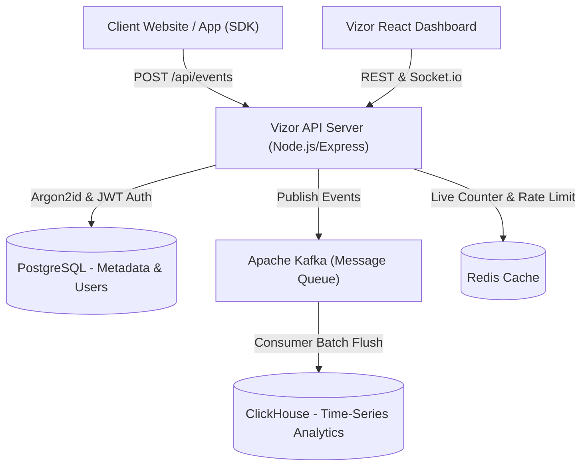

# Vizor AI — Real Human & Click Fraud Intelligence Platform

[](LICENSE)
[](https://nodejs.org)
[](https://www.postgresql.org/)
[](https://clickhouse.com/)
[](https://kafka.apache.org/)

**Vizor AI** is an enterprise-grade, high-throughput **Click Fraud & Bot Detection Platform** designed to protect ad budgets, detect headless automation, and analyze visitor behavioral signals in **sub-50ms**.

Built with an obsidian-gold cyber-intelligence aesthetic, Vizor features continuous multi-dimensional scoring, real-time threat neutralization, visual click heatmaps, and session playback.

---

## 🌟 Key Features

- **🚀 Sub-50ms Autonomous Neural Scoring**: Rule-based & behavioral risk analysis evaluating CDP automation fingerprints, mouse trajectories, rage clicks, and IP proxy/Tor masks.
- **🔐 Argon2id Password Encryption**: Password hashing using **Argon2id** (64MB memory cost, 4 time cost) — OWASP recommended standard for maximum brute-force protection.
- **⚡ High-Throughput Ingestion Architecture**: Powered by **Apache Kafka** event streaming, **ClickHouse** columnar time-series storage, and **Redis** in-memory caching.
- **📊 13 Dynamic Analytics Modules**:
  1. **Dashboard Overview**: Real-time traffic composition stream, threat neutralization feed, KPI summaries.
  2. **Live Visitors**: Auto-refreshing 10s telemetry feed with trust scores and dwell time.
  3. **Visitor Sessions Explorer**: Session logs with scroll depth, click counts, and replay triggers.
  4. **Click Fraud Intelligence**: Detection of click farms, VPN/Proxy abuse, and risk scores.
  5. **Bot Detection Engine**: Governance for Puppeteer, Selenium, Headless Chrome, and AI crawlers.
  6. **Geographic Intelligence**: Multi-country traffic breakdown with localized bot rates.
  7. **Device & Platform Analytics**: Device share, browser, and operating system distribution.
  8. **Campaign & UTM Intelligence**: Track ad budget waste per source/medium.
  9. **Visual Heatmap Overlay**: Real-time click, move, and scroll heatmaps with human vs. bot color differentiation.
  10. **Click Quality Analysis**: Click coordinate scatter plot, rage clicks, and dead clicks.
  11. **Session Replay Player**: Interactive DOM session playback simulator.
  12. **Executive Reports Center**: One-click summary audit reporting.
  13. **Site & Integration Settings**: Multi-domain configuration, webhook triggers, and tracking snippet.

---

## 🏗️ Architecture Stack



| Layer | Technology | Purpose |
|---|---|---|
| **Frontend** | React 18, Vite, TailwindCSS, Lucide Icons, Recharts, React Query | Cyber-intelligence dashboard |
| **Backend API** | Node.js, Express, Argon2id, JWT | Sub-50ms REST API & Socket.io server |
| **Relational DB** | PostgreSQL 15 | Users, sites, webhooks, audit logs |
| **Time-Series DB** | ClickHouse 23.8 | High-throughput event & session analytics |
| **Event Stream** | Apache Kafka | Event buffer for burst bot attack mitigation |
| **Cache** | Redis 7 | In-memory session tokens & live counter |

---

## 📦 Quick Start & Installation

### Prerequisites

- **Node.js** v18+ & **npm**
- **Docker & Docker Desktop** (for ClickHouse, Kafka, Zookeeper, Redis)
- **PostgreSQL** running locally (or via Docker)

### 1. Clone Repository

```bash
git clone https://github.com/Kaleb4B/vizor.git
cd vizor
```

### 2. Start Infrastructure Containers

```bash
docker compose up -d
```

### 3. Setup Backend

```bash
cd backend
cp .env.example .env
npm install

# Push database schema to PostgreSQL
DATABASE_URL="postgresql://postgres@localhost:5921/web_security?schema=public" npx prisma db push

# Start Backend Server
node src/server.js
```

Backend API will start at `http://localhost:4000`.

### 4. Setup Frontend Dashboard

```bash
cd ../frontend
npm install
npm run dev
```

Open Dashboard at **[http://localhost:5173](http://localhost:5173)**.

---

## 🔌 Tracking Script Embed Code (`clickguard.js`)

Add the following snippet before the closing `</head>` tag of your website:

```html
<script src="http://localhost:4000/clickguard.js"></script>
<script>
  ClickGuard.init({ 
    websiteId: "site-001", 
    apiKey: "vz_live_tk8f3b2d91a4e7c6f5" 
  });
</script>
```

---

## 🔒 Security & Operator Authentication

- **Authentication Method**: JWT Bearer Token & Argon2id Password Hashing (OWASP Recommended)
- **Operator Configuration**: Set `OPERATOR_EMAIL` and `OPERATOR_PASSWORD` in `backend/.env`.

---

## 📄 License & Copyright

Copyright (c) 2026 **kalebdap**. Released under the [MIT License](LICENSE).
